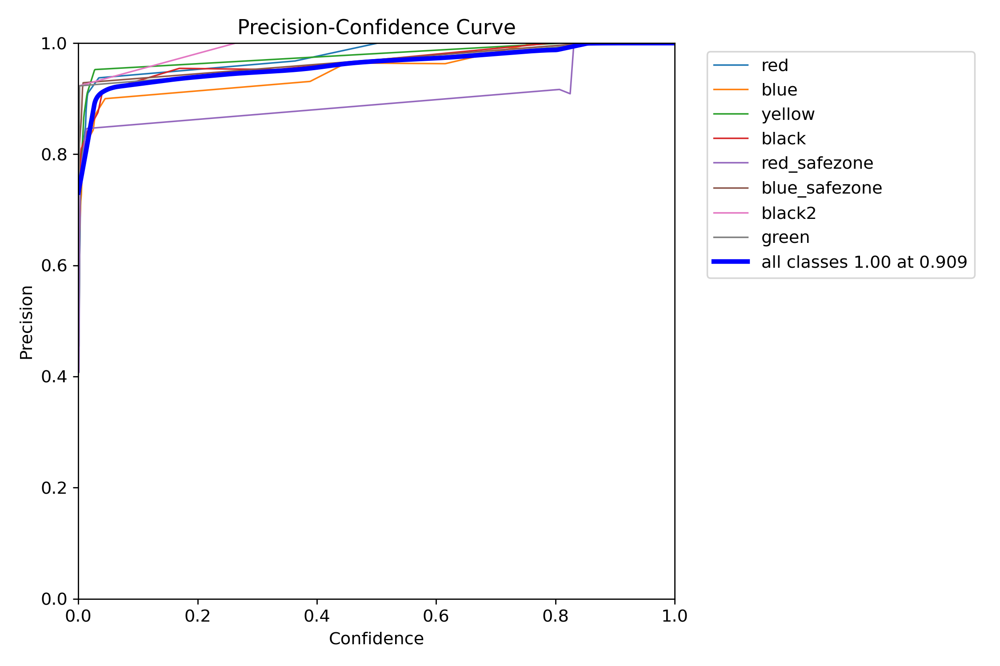
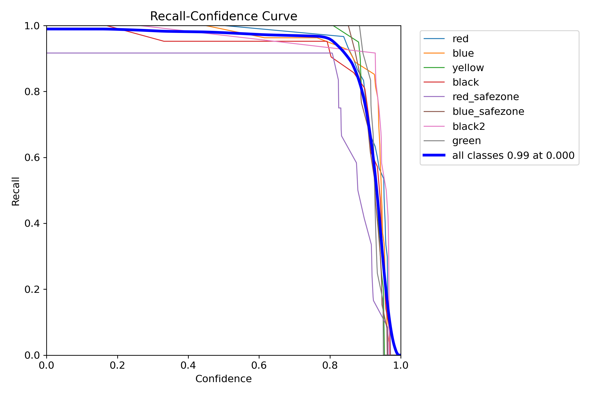
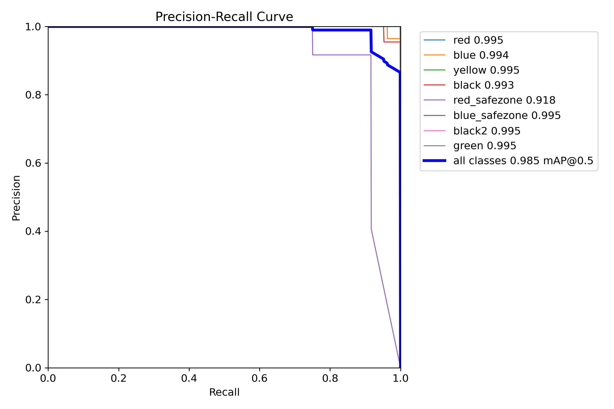
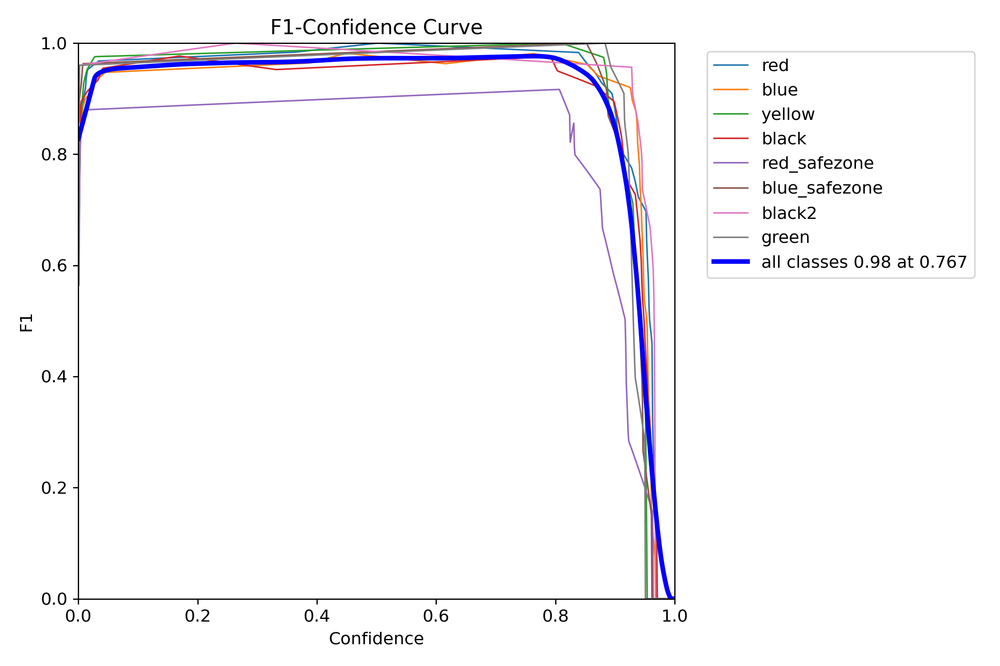
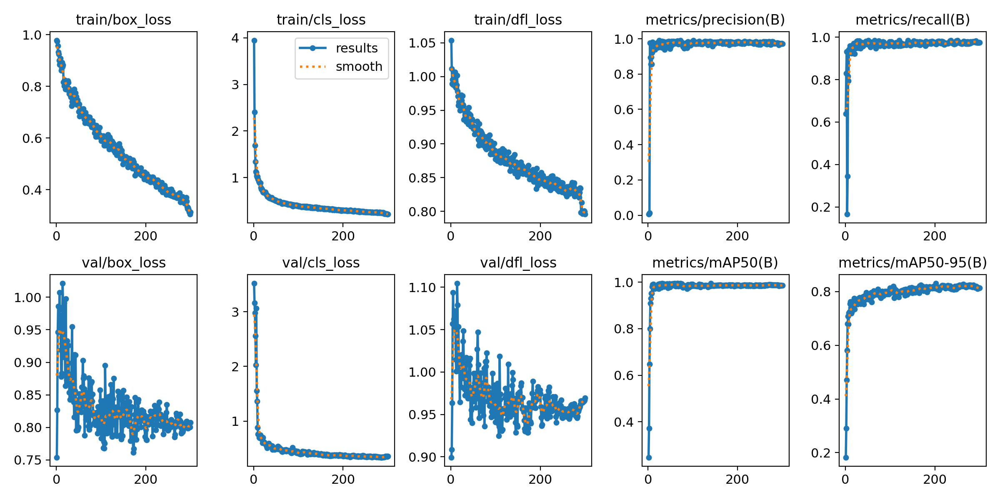

*From the state of art to deploy your models in reality*
# Learn machine learning basics
Use [pytorch](https://pytorch.org/) python API to build a MNIST-recognize CNN.Pytorch can run on a local machine using CPU,so dont worry about the nVIDIA GPU requirement.
```shell
(conda)pip3 install torch torchvision torchaudio
```
## Basic ideas
Lets begin by introducing some basic idea in CNN and proform them in pytorch.
### tensor
Tensor is the very basic data structure in machine learning.From a developer`s prespective,tensor is the nickname of high-dimension array in machine learning.For example,we introduce a 2D-array in C:
```C
int arr[m][n];
```
This is a tensor in 2 dimensions.In pytorch,we can declare a tensor using:(*see tensor.py*)
```python
tensor=torch.rand(shape)
``` 
And check its attributes using:
```python
tensor.shape
tensor.dtype
tensor.device
```
And manipulate it using:
```python
tensor.add_(1)
```

## evaluation
### figures
In general
#### P_curve

#### R_curve

#### PR_curve

#### F1_curve

### training results


#### mAP
* `mAP50`
* `mAP50-95`
#### precision/recall
* `precision`
* `recall`
#### box/cls/dfl loss
* `box_loss`
* `cls_loss`
* `dfl_loss`

# Train DNN model (take YOLO for an example)
## Setup CUDA environment (Nvidia GPU required,better if with 10GB+ video memory )
* install CUDA
  ```bash
  #check adoptable cuda verison
  $bash
  nvidia-smi
  ```
  ```
  Thu Apr  3 16:29:48 2025
  +-----------------------------------------------------------------------------------------+
  | NVIDIA-SMI 555.97                 Driver Version: 555.97         CUDA Version: 12.5     |
  |-----------------------------------------+------------------------+----------------------+
  | GPU  Name                  Driver-Model | Bus-Id          Disp.A | Volatile Uncorr. ECC |
  | Fan  Temp   Perf          Pwr:Usage/Cap |           Memory-Usage | GPU-Util  Compute M. |
  |                                         |                        |               MIG M. |
  |=========================================+========================+======================|
  |   0  NVIDIA GeForce RTX 4080 ...  WDDM  |   00000000:01:00.0 Off |                  N/A |
  | N/A   33C    P3             15W /   55W |       0MiB /   16376MiB |      0%      Default |
  |                                         |                        |                  N/A |
  +-----------------------------------------+------------------------+----------------------+
  ```

  find required **CUDA Version** on [NVIDIA CUDA](https://developer.nvidia.com/cuda-toolkit-archive)
* install cuDNN

  select cuDNN version base on CUDA version on [NVIDIA cuDNN](https://developer.nvidia.com/rdp/cudnn-archive)

  extract cuDNN and cut **bin,include,lib** to where you install CUDA, for example C:/program files/NVIDIA GPU Computing Toolkit/CUDA/12.5

* check environment
  ```bash
  $bash
  cd path/to/cuda/demo_suite # for example C:\Program Files\NVIDIA GPU Computing Toolkit\CUDA\v12.5\extras\demo_suite
  .\bandwidthTest.exe

  ```
  output
  ```
  [CUDA Bandwidth Test] - Starting...
  Running on...

  Device 0: NVIDIA GeForce RTX 4080 Laptop GPU
  Quick Mode

  Host to Device Bandwidth, 1 Device(s)
  PINNED Memory Transfers
  Transfer Size (Bytes)        Bandwidth(MB/s)
  33554432                     12707.6

  Device to Host Bandwidth, 1 Device(s)
  PINNED Memory Transfers
  Transfer Size (Bytes)        Bandwidth(MB/s)
  33554432                     12803.5

  Device to Device Bandwidth, 1 Device(s)
  PINNED Memory Transfers
  Transfer Size (Bytes)        Bandwidth(MB/s)
  33554432                     149433.4

  Result = PASS
  ```
## Dependent installation
* Create isolated conda envs
  ```shell
  $conda:
  (base)conda create -n YOLO python=3.8
  ```
* Activate environment
  ```shell
  $conda:
  (base)conda activate YOLO
  (YOLO)
* install [pytorch](https://pytorch.org/get-started/locally/)
  ```shell
  $conda:
  # select your vision on the website!
  (YOLO) conda install pytorch==2.5.1 torchvision==0.20.1 torchaudio==2.5.1 pytorch-cuda=12.1 -c pytorch -c nvidia 
  

* install ultralytics

  YOLO core code is packed in ultralytics lib  
  ```shell
  $conda 
  (YOLO) pip install ultralytics
  ```

* clone ultralytics git repo
  ```bash
  $git bash
  git clone https://github.com/ultralytics/ultralytics
  ```
  all models are included in the repo,so just clone the newest one.

* run enviornment
  ```bash
  $python
  cd DNNmanual/yolo
  python test_cuda.py
  ```
  ```
  output:
  2.4.1+cu124
  True
  1
  90100
  12.4
  ```
## Train
### Building datasets(standard YOLO format)
* Labelimg

  download on [labelimg](https://github.com/HumanSignal/labelImg)

 * **build labelimg** on windows
    ```shell
    $conda
    (base)conda create -n Labelimg python=3.8
    (base)conda activate Labelimg
    (Labelimg)conda install pyqt=5
    (Labelimg)conda install -c anaconda lxml
    (Labelimg)cd path/to/labelimg #change to you dir
    (Labelimg)pyrcc5 -o libs/resources.py resources.qrc
    (Labelimg)python labelImg.py  #run labelImg
    (Labelimg)python labelImg.py -i [path/to/images/dir] -o [path/to/save/dir] -l [path/to/prebuild/label.txt]
    Or (Labelimg)python labelImg.py -d [path/to/dataset/dir] -l [path/to/prebuild/label.txt]
    ```

* The procedure to create train/val/test files is automated by using **gen_data_yolo.py** 
  ```bash
  $bash:
  (YOLO)python gen_data_yolo.py
  ```

  The func will split data in ./dataset/data in proportion to ./dataset/test | train | val
* The format of the data set is known as Darknet YOLO, Each image corresponds to a .txt label file. The label format is based on YOLO's data set label format: "category cx cy wh", where category is the category subscript, cx, cy are the coordinates of the center point of the normalized label box, and w, h are the normalized label box The width and height, .txt label file content example as follows:
  ```
  11 0.344192634561 0.611 0.416430594901 0.262
  14 0.509915014164 0.51 0.974504249292 0.972
  ```
* The image and its corresponding label file have the same name and are stored in the same directory. The data file structure is as follows:
  ```
  dataset
  ├── train
  │   ├── 000001.jpg
  │   ├── 000001.txt
  │   ├── 000002.jpg
  │   ├── 000002.txt
  │   ├── 000003.jpg
  │   └── 000003.txt
  └── val
      ├── 000043.jpg
      ├── 000043.txt
      ├── 000057.jpg
      ├── 000057.txt
      ├── 000070.jpg
      └── 000070.txt
  ```
* Generate a dataset path(use absolute path) .txt file, the example content is as follows：
  
  train.txt
  ```
  C:/Desktop/YOLO/dataset/train/000001.jpg
  C:/Desktop/YOLO/dataset/train/000002.jpg
  C:/Desktop/YOLO/dataset/train/000003.jpg
  ```
  val.txt
  ```
  C:/Desktop/YOLO/dataset/val/000070.jpg
  C:/Desktop/YOLO/dataset/val/000043.jpg
  C:/Desktop/YOLO/dataset/val/000057.jpg
  ```
* Generate the .names category label file, the sample content is as follows:
 
  category.names
  ```
  person
  bicycle
  car
  motorbike
  ...
  
  ```
* The directory structure of the finally constructed training data set is as follows:
  ```
  .
  ├── category.names        # .names category label file
  ├── train                 # train dataset
  │   ├── 000001.jpg
  │   ├── 000001.txt
  │   ├── 000002.jpg
  │   ├── 000002.txt
  │   ├── 000003.jpg
  │   └── 000003.txt
  ├── train.txt              # train dataset path .txt file
  ├── val                    # val dataset
  │   ├── 000043.jpg
  │   ├── 000043.txt
  │   ├── 000057.jpg
  │   ├── 000057.txt
  │   ├── 000070.jpg
  │   └── 000070.txt
  └── val.txt 
  ├── test                    # val dataset
  │   ├── 000043.jpg
  │   ├── 000043.txt   
  └── test.txt             # val dataset path .txt file

  ```
  
### Build the training dataset.yaml configuration file
* ball.yaml for reference
  ```
  path: ./dataset # dataset root dir
  train: train.txt # train images (relative to 'path')
  val: val.txt # val images (relative to 'path')
  test: test.txt # test images (relative to 'path')

  # Classes
  names:
    0: person
    1: bicycle
    2: car
    3: motorcycle
    4: airplane
  ```
### Train
* modify yolo.yaml in ultralytics git repo at *ultralytics\ultralytics\cfg\models*
  ```
  ...
  nc:6 #change the number to match your dataset.yaml
  ...
  #no other change needed
  ```
* Perform training tasks in CLI
  ```conda
  $conda
  (YOLO)path/to/ultralytics> 
 * Build a new model from YAML and start training from scratch
    ```shell
    $conda
    (YOLO)path/to/ultralytics>yolo detect train data=coco8.yaml model=yolo11n.yaml epochs=100 batch=16
    ```
 * Start training from a pretrained *.pt model
    ```shell
    yolo detect train data=coco8.yaml model=yolo11n.pt epochs=100
    ```
 * Build a new model from YAML, transfer pretrained weights to it and start training
    ```shell
    yolo detect train data=coco8.yaml model=yolo11n.yaml pretrained=yolo11n.pt epochs=100 batch=16
    ```
* Perform training tasks using Python API
  ```bash
  $bash
  python train.py #change parameters in train.py
  ```

  param:

  *model* calls the model you want, it will call yolon if you use the name yolon.yaml 
  
  *pretrained* uses pretrained model to enhance the performance of your model, the pretrained model will be downloaded automatically when you use the pretrained parameter

  *epochs* is the total number of rounds you run. Refer to Internet for more info.

  *batch* is the number of picture put in GPU at one time.Take in three kinds of parameter. Set as an integer (e.g., batch=16), auto mode for 60% GPU memory utilization (batch=-1), or auto mode with specified utilization fraction (batch=0.70).#best pratice -1 or 0.80
## Evaluation 
* test on test to see model`s **Generalization ability**
  ```shell
  conda$
  (YOLO)path/to/ultralytics>yolo predict model=dir/to/your/best.pt(ex. runs/detect/train/weights/best.pt) source=dir/to/your/test_folders
  ```
    result will save in ultralytics/runs/predict
* val on val to fine-tune superparameters
  ```shell
  conda$
  (YOLO)path/to/ultralytics>yolo val model=dir/to/your/best.pt(ex. runs/detect/train/weights/best.pt) data=dir/to/your/data.yaml
  ```
    result will save in ultralytics/runs/val
    
    you can see the graph to evaluate training superparams
# Deploy
## Export onnx
* 
  ```conda
  (YOLO)path/to/ultralytics>yolo export model=path/to/best.pt format=onnx
  ```
  onnx is a

*This instruction is written by Fangyao Zhao at HUST/Berkeley nicknamed as liyuu1ove on github,following the MIT license,please be careful when you spread it*